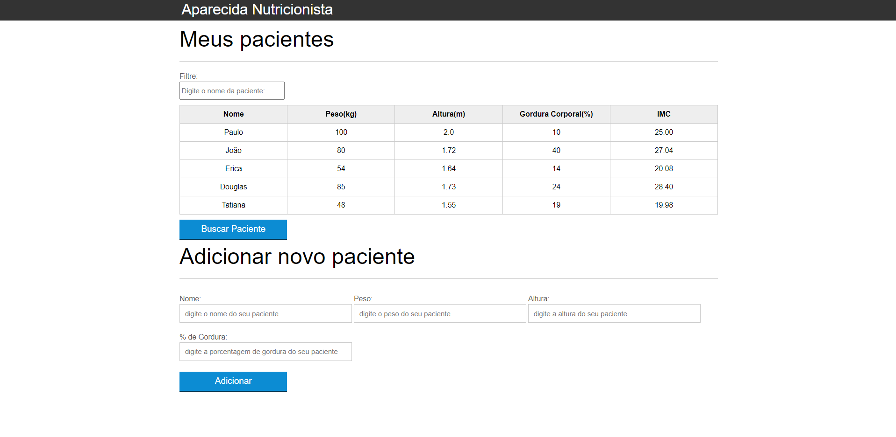
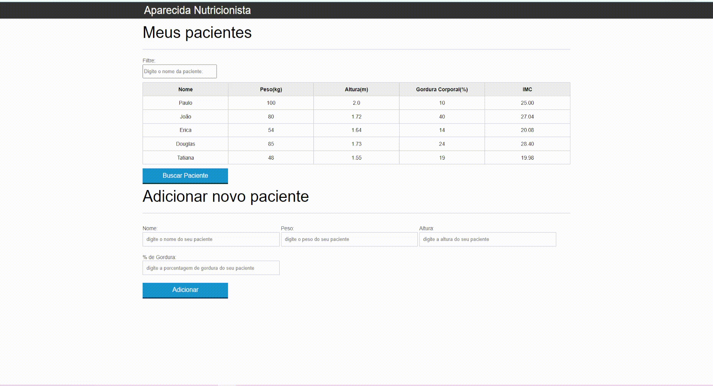

# aparecida-nutricao-alura

  

Este repositório é destinado ao projeto que desenvolvi com base nas aulas do Curso de JavaScript: Programando na linguagem da web, da Alura. 

## Aparecida Nutricionista:

    

O conteúdo deste curso é voltado exclusivamente para o desenvolvimento de um site que fornecerá o controle e manipulação dos dados de nutrição dos pacientes  para um nutricionista.

Além disso, o foco do curso está no desenvolvimento com <b>JavaScript</b>.

**Objetivos principais:**

- Entender mais como funciona esta popular linguagem do mercado;
- Aprender a manipular os elementos de sua página;
- Trabalhar bem com eventos do navegador;
- Entender como utilizar e validar formulários;
- Conhecer boas práticas de organização de código Javascript;
- Implementação da busca de dados em outro servidor com AJAX.

**Neste curso, as seguintes abordagens do JavaScript tiveram foco:**

- Variáveis e operadores;
- Arrays, Loop e Estilos;
- Eventos, Formulários e criação de elementos;
- Boas práticas com JavaScript;
- Remoção, delegação e animação;
- Filtro em tabela; 
- XMLHttpRequest; e 
- Requisição AJAX.

## Tecnologias 

- [HTML5](https://html.com/)
- [CSS3](https://www.w3.org/Style/CSS/Overview.en.html)
- [JavaScript](https://www.javascript.com/)

## Resultados

## Status do projeto/curso

**Concluído.**